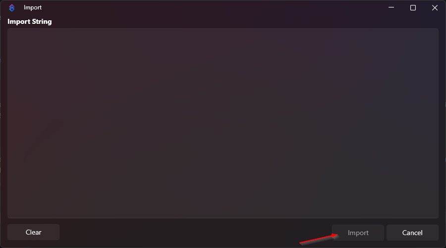

# First Words - User Greetings

This collection of StreamerBot Actions will allow you to run a collection of sub-Actions after a user submits their 
First Words in a stream to greet them. It can be a single sub-Action like just a greeting, but it can also be more 
information like an message introducing a specific person to the rest of the stream as well as anything that StreamerBot 
is capable of.

The logic included here allows for:
* Running user specific Actions
* Running an Action for moderators
* Running an Action for VIPs
* Running an Action for Subscribers
* Running an Action for users that don't fit the above categories

There is a main "Greetings" Action which will then call another Action based on the user.

After importing this code into StreamerBot, there will be a "Greetings" Action group. In here there will be a number of 
standalone Actions for each type of greeting.

To implement the user specific Actions, create an Action named "greet_" and then the username in all lowercase letters. 
There is an example "greet_phaiting" in that group.

When the main "Greetings" Action runs, it will look for an Action named using this pattern and run it. This Action 
only needs to include the sub-Actions that you want to run and it does not need to include any other logic.

If a user specific Action is not found, the logic will then check to see what user category Action to run.

A tutorial video is on YouTube here: https://youtu.be/jrvEUXhLTfM

## Install
Click "Calculator.sb" in the repo then click the "Download" button to download it to your computer.

In Streamer.bot on your computer click the "Import" menu to open the import dialog.

On your computer, drag the "Calculator.sb" file and drop it into the window. Click the "Import" button.

(There is a general video tutorial on importing into Streamer.bot here: https://youtu.be/gHqw3gwpbco)

## Dependencies
This collection of Actions is packaged with my "Run Action by Name" Action.
