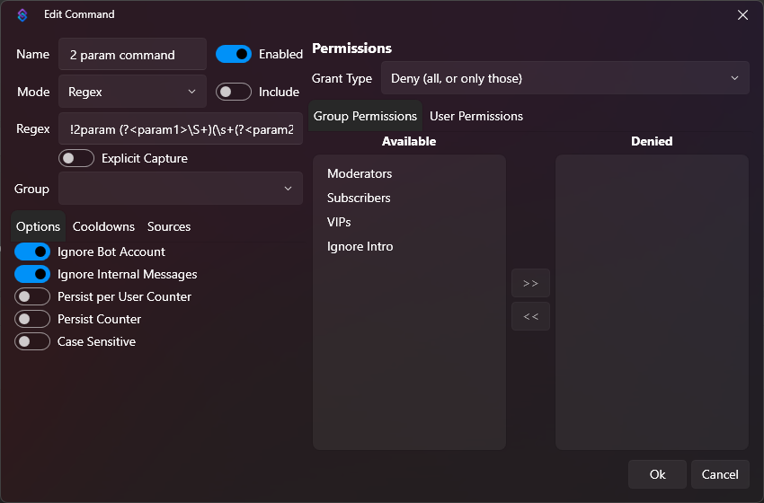
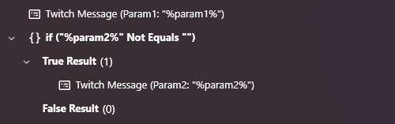

# Example 2 Parameter Chat Command

Creating a chat command in Streamer.bot that accepts a single parameter is fairly straightforward.
Whatever someone types after a "normal" chat command is put into a `rawInput` variable for your Action to usw.

Let's say you want a command that accepts a username and then a number. There are a number of ways to accomplish this
in Streamer.bot but this is one way to do it that you can use as a starting point. This particular method leverages
[Regular Expressions](https://en.wikipedia.org/wiki/Regular_expression). Yes, RegEx can be intimidating, but I've done
the work for you. I will try to provide some explanation though.

So, the work happens in the creation of the Command in Streamer.bot. It looks like this:

The key parts here are the "Mode" which is set to "Regex", and then the value of the "Regex" field.
In this example, the field contains:

`!2param (?<param1>\S+)(\s+(?<param2>\S+))?`

For your command, use that value but replace `!2param` with whatever you want your command to be. In your Action,
the first paramater will be available via `%param1%` and the second parameter will be available via `%param2%`.
If there is only 1 parameter, this command will still work. The second paramater will just be an empty string.

You can see it in use here:

You can import the contents of the file "Example 2 Parameter Command.sb" to try it for yourself.

## Breaking Down the Regex
This is the Regex in use:

`!2param (?<param1>\S+)(\s+(?<param2>\S+))?`

The first part is `!2param `. This is just a literal match. Streamer.Bot will look for a chat message that starts with
these exact characters.

The next section is `(?<param1>\S+)`. This section surrounded by `(` and `)` is considered a capture group. This is being
used to capture the first parameter. The `?<param1>` indicates that this group will be named "param1". Streamer.bot 
uses this name (`param1`) to create the variable that will be available to your Action.

The next part is `\S+`. The `\S` matches any non-space character. The `+` after it indicates that there needs
to be 1 or more consecutive non-space characters. Assuming that a chat message matches this capture group, that value will
be assigned to the `param1` variable.

The next part is `(\s+(?<param2>\S+))?`. This is a next capture group. Since it has a `?` at the end, it is optional.
This allows the command to be used with only 1 parameter.

Breaking this down, the `\s` matches a space character. The `+` again, indicates that it must match 1 or more consecutive characters.

Within this group, there is another group `(?<param2>\S+)`. This should look similar to the first parameter that was captured.
It is the same except that the name is `param2`. If this optional section matches, Streamer.bot will make the matching value
available to your Action in a `param2` variable.

