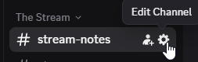
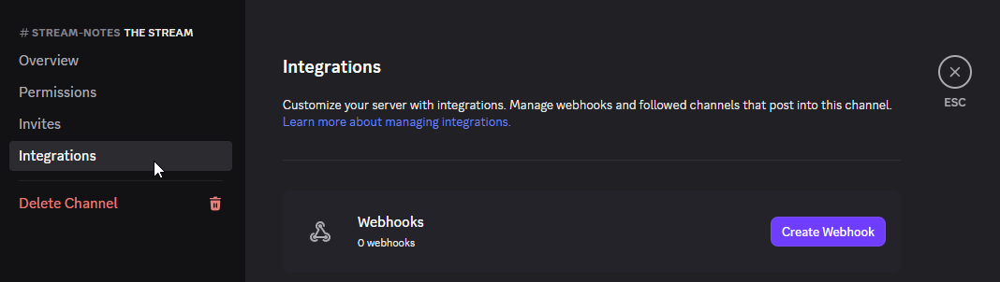
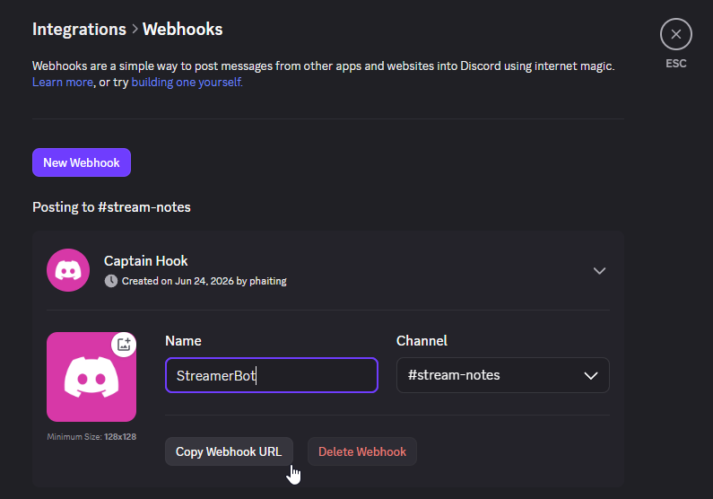
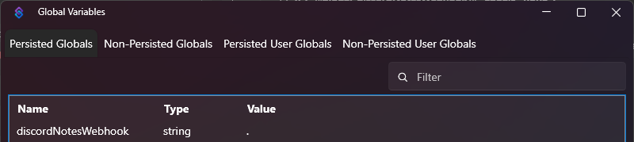
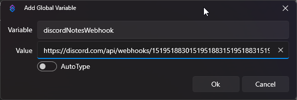

# Stream Notes with Discord

The Stream Notes command ("!note") will let you record a log of things that you want to review later. It can be
inconvenient to grab a pen and paper or to record a note in a separate program. This lets you record that thought right
from chat.

The original version saved the notes to a text file. This version will save the notes to a Discord channel.

Features:
- As with the default Stream Notes, create notes directly from chat to review later `!note <some text>`
- If you allow users other than the broadcaster to use the command, the user's name will be included in the note

Examples:

If you had a giveaway and PhaiTing won, you could use:

`!note Remember to give a prize to PhaiTing`

If you want to look something up after the stream, you could use:

`!note Look up PhaiTing's StreamerBot tools on Github`

## Configuration
First, you will need to create a webhook URL for the Discord channel where you want notes saved.

Go into Discord and edit the channel where you want the notes to be saved.

Choose "Integrations" and then click the "Create Webhook" button.

You can change the "Name" to what you want the notes posted from. Click the "Copy Webhook URL" button to get the webhook URL
to put in Streamer.bot

Now that you have the webhook URL, go to Streamer.bot and create a Persisted Global Variable called "discordNotesWebhook" and use your
webhook URL as the value.

This action includes a command. Imported commands are disabled by default, so be sure to enable it.

Note: The API calls to Todoist have been implemented as separate Actions so that you can reuse them in your own StreamBot projects.
The calls to Todoist have been written in C#.
- Create Task
- Quick Add
- Search Projects

See: https://developer.todoist.com/api/v1/
