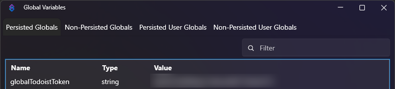
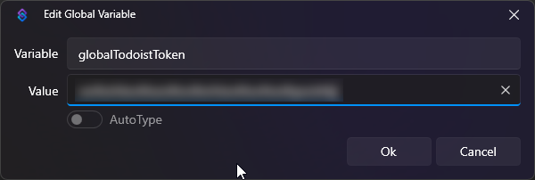
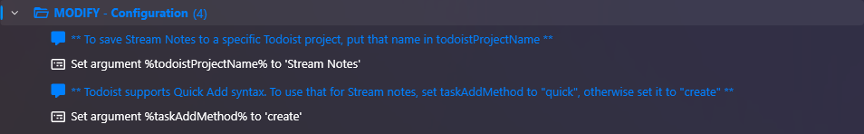
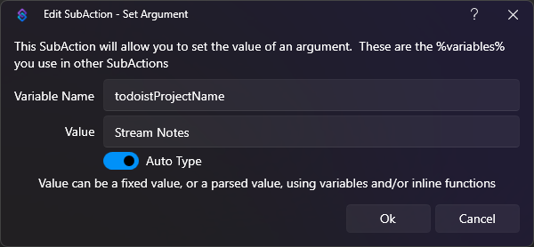
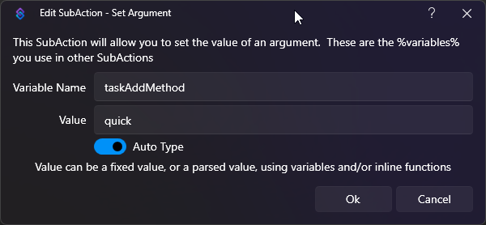

# Stream Notes with Todoist

The Stream Notes command ("!note") will let you record a log of things that you want to review later. It can be 
inconvenient to grab a pen and paper or to record a note in a separate program. This lets you record that thought right 
from chat.

The original version saved the notes to a text file. This version will save the notes to Todoist as tasks.

Features:
- As with the default Stream Notes, create notes/tasks directly from chat to review later `!note <some text>`
- Optionally configure a default Todoist project for new notes
- Choose between basic task creation and "Quick Add" task creation which parses the note text
- When using Quick Add, the default project can be overridden in the note text
- If you allow users other than the broadcaster to use the command, the user's name will be included in the note

Examples:

If you had a giveaway and PhaiTing won, you could use:

`!note Remember to give a prize to PhaiTing`

If you want to look something up after the stream, you could use:

`!note Look up PhaiTing's StreamerBot tools on Github`

## Configuration
First, you will need to create a persisted Global Variable with your Todoist API Token.
https://www.todoist.com/help/articles/find-your-api-token-Jpzx9IIlB

Once you have it, go to Streamer.bot and create a Persisted Global Variable called "globalTodoistToken" and use your
token as the value.

By default, Stream Notes will be saved as tasks in the Inbox but a default project can be set by updating the `todoistProjectName` variable.

Tasks can be added using Todoist's Quick Add (`quick`) or the normal Create Task (`create`) method.
Set `taskAddMethod` to your desired method.

This action includes a command. Imported commands are disabled by default, so be sure to enable it.

Note: The API calls to Todoist have been implemented as separate Actions so that you can reuse them in your own StreamBot projects.
The calls to Todoist have been written in C#.
- Create Task
- Quick Add
- Search Projects

See: https://developer.todoist.com/api/v1/
