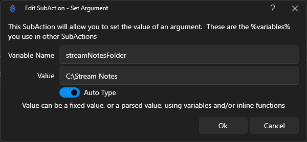

# Stream Notes Command

The Stream Notes command ("!note") will let you record a log of things that you want to review later. It can be 
inconvenient to grab a pen and paper or to record a note in a separate program. This lets you record that thought right 
from chat.

A new file is created by calendar day and each entry in the file has a timestamp.

Examples:

If you had a giveaway and PhaiTing won, you could use:

`!note Remember to give a prize to PhaiTing`

If you want to look something up after the stream, you could use:

`!note Look up PhaiTing's StreamerBot tools on Github`

## Install
Click "Stream Notes.sb" in the repo then click the "Download" button to download it to your computer.

In Streamer.bot on your computer click the "Import" menu to open the import dialog.

On your computer, drag the "Stream Notes.sb" file and drop it into the window. Click the "Import" button.

(There is a general video tutorial on importing into Streamer.bot here: https://youtu.be/gHqw3gwpbco)

## Configuration
The default Stream Notes folder is `C:\Stream Notes` but it can be changed by updating the `streamNotesFolder` variable.

This action includes a command. Imported commands are disabled by default, so be sure to enable it.

A tutorial video is on YouTube here: https://youtu.be/xxI1wpCxPHs