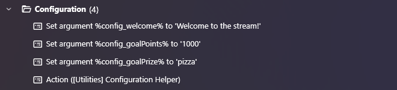
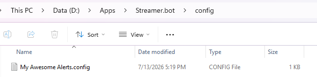
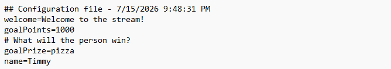

# Configuration Helper

When making Streamer.bot tools available to other people, there are often opportunities to let users customize the
tool to suit their needs or to just give it their own personality. That can be accomplished a number of ways including 
by asking users to modify your code or by using persisted global variables. Unfortunately, when a user modifies your code, it is difficult to import updated versions. Persisted global variables
are handled via a small dialog so working with a long list can be difficult.

Many other applications handle customization via configuration files. It allows users to update the application
without blowing away the configuration. It also groups all the configurations into a single place.

Configuration Helper lets Streamer.bot actions work with configuration files just by adding a sub-action to call the
Configuration Helper action (`Core -> Actions -> Run Action`). It will create the configuration file with your default values on the first run of your action.
On subsequent runs, it will read from that configuration file.

## Install
Click "Utility - Configuration Helper.sb" in the repo then click the "Download" button to download it to your computer.

In Streamer.bot on your computer click the "Import" menu to open the import dialog.

On your computer, drag the "Utility - Configuration Helper.sb" file and drop it into the window. Click the "Import" button.

(There is a general video tutorial on importing into Streamer.bot here: https://youtu.be/gHqw3gwpbco)

## How to Use
In the Streamer.bot action that you are creating, add a set of “set argument” sub-actions to set up the various 
messages and values that you want to let users customize. Those argument names need to start with “config_”. 

After that section, add a sub-action to run the Configuration Helper action.

No additional code is needed.

## How It Works
The first time the action runs, it creates a `config` directory within the Streamer.bot directory if it doesn't already exist.
It then creates a configuration file and writes all of the current variables that start with "config_". The name of the 
configuration file will be the name of your Action with a ".config" extension. If your Action was named "My Awesome Alerts",
the file would be named "My Awesome Alerts.config".

The content of the file will be a header followed by a line for each variable and value. The "_"'s in the variable names will be replaced with "."'s.

If the Configuration Helper action is run a second time in your Action, the tool will replace the values in the file
with all of the "config_" variables available at the time the helper runs. This can be used to add configurations to
the file after it was originally created.

A tutorial video is on YouTube here: https://youtu.be/NpmD9ED9qZc