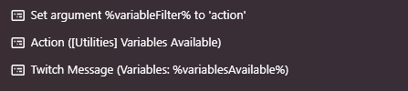

# Variables Available

A list of all currently available variables is accessible via C# but not from native Streamer.bot actions.
This action will retrieve those variables via C# and create a comma delimited list accessible by other actions.

A prefix can be specified to filter the list of variables.

## Example

## Functions

**Input**

| Variable       | Value                                               |
|----------------|-----------------------------------------------------|
| variableFilter | optional prefix string to filter the variable names |

**Output**

| Variable           | Value                                                        |
|--------------------|--------------------------------------------------------------|
| variablesAvailable | comma delimited list of the names of the available variables |

